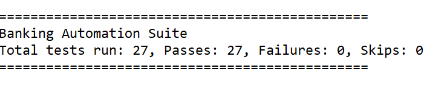
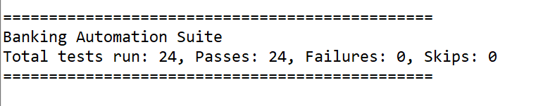
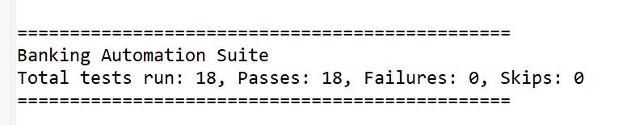
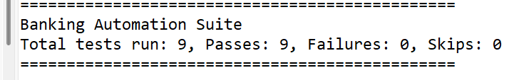

# Banking Application Test Automation Framework 🏦

## 📋 Overview
Enterprise-grade automated testing framework for [Guru99 Banking Demo](https://demo.guru99.com/V4/) application using Selenium WebDriver, Java, and TestNG. Implements **Page Object Model** design pattern with centralized configuration, parallel execution, and cross-browser support.

## 🛠️ Tech Stack
- **Language**: Java 11
- **Automation Tool**: Selenium WebDriver 4.27.0
- **Testing Framework**: TestNG 7.11.0
- **Build Tool**: Maven 3.6+
- **Driver Management**: WebDriverManager 5.9.2
- **Design Pattern**: Page Object Model (POM)
- **Browsers**: Chrome, Firefox, Edge (parallel execution)

## 📁 Project Structure
```
selenium-banking-demo/
├── src/
│   ├── main/java/
│   │   ├── pages/                    # Page Object classes
│   │   │   ├── LoginPage.java       # Login page interactions
│   │   │   └── DashboardPage.java   # Dashboard & sub-pages
│   │   └── utils/                    # Utility classes
│   │       └── DriverManager.java   # Browser driver management
│   └── test/java/
│       └── tests/                    # Test suites
│           ├── BaseTest.java        # Base test with centralized config
│           ├── LoginTest.java       # Login functionality tests
│           ├── DashboardTest.java   # Dashboard tests
│           ├── BalanceEnquiryTest.java          
│           └── ...more test suites
├── pom.xml                          # Maven dependencies
├── testng.xml                       # TestNG parallel execution config
└── README.md
```

## ✨ Key Features

### 🎯 Test Architecture
- ✅ **Page Object Model** - Separation of page logic and test logic
- ✅ **Centralized Configuration** - Login credentials in `BaseTest`
- ✅ **Helper Methods** - `loginToDashboard()` to eliminate code duplication
- ✅ **Robust Element Interaction** - JavaScript click fallback for reliability
- ✅ **Explicit Waits** - Smart waiting strategies for stable tests

### 🚀 Execution Features
- ✅ **Parallel Execution** - Run tests across 3 browsers simultaneously
- ✅ **Cross-Browser Testing** - Chrome, Firefox, Edge support
- ✅ **Headless Mode** - Fast execution without GUI (CI/CD ready)
- ✅ **Thread-Safe Driver** - ThreadLocal for parallel test safety
- ✅ **Automatic Driver Management** - No manual driver downloads needed

### 🧪 Test Coverage
- ✅ Login functionality (valid, invalid, empty credentials)
- ✅ Dashboard navigation and verification
- ✅ Balance enquiry validation
- ✅ Form field validations
- ✅ Customer management (add, edit, delete)
- ✅ Account operations
- ✅ Fund transfers
- ✅ And more...

## 🚀 Getting Started

### Prerequisites
- **Java JDK 11** or higher ([Download](https://adoptium.net/))
- **Maven 3.6+** ([Download](https://maven.apache.org/download.cgi))
- **Browsers**: Chrome, Firefox, and/or Edge

### Installation
1. **Clone the repository:**
```bash
git clone https://github.com/jodieweiwei/selenium-banking-demo.git
cd selenium-banking-demo
```

2. **Install dependencies:**
```bash
mvn clean install
```

## 🎮 Running Tests

### Run All Tests (Parallel Execution)
```bash
mvn clean test
```

### Run in Headless Mode (Faster - No Browser Windows)
```bash
mvn clean test -Dheadless=true
```

### Run Specific Test Suite
```bash
mvn test -Dtest=LoginTest
mvn test -Dtest=DashboardTest
mvn test -Dtest=BalanceEnquiryTest
```

### Run via TestNG XML
```bash
mvn test -DsuiteXmlFile=testng.xml
```

## 📊 Test Execution Configuration

### Parallel Execution (testng.xml)
```xml
<suite name="Banking Automation Suite" parallel="tests" thread-count="3">
    <!-- Tests run in parallel across Chrome, Firefox, Edge -->
</suite>
```

### Browser Configuration
- **Default**: Headless mode OFF (windows visible)
- **Headless**: Add `-Dheadless=true` to command line
- **Browser**: Configurable per test via TestNG parameters

## 🏗️ Framework Highlights

### Centralized Login Helper
```java
// In BaseTest.java
protected String loginUsername = "mngr647463";
protected String loginPw = "EtUgYbU";

protected DashboardPage loginToDashboard() {
    LoginPage loginPage = new LoginPage(driver);
    return loginPage.login(loginUsername, loginPw);
}

// Usage in tests - just one line!
DashboardPage dashboard = loginToDashboard();
```

### Robust Click Mechanism
```java
// JavaScript fallback if regular click fails
private void waitSubMenuIsClickableAndClick(By menuLocator) {
    try {
        wait.until(ExpectedConditions.elementToBeClickable(menuLocator)).click();
    } catch (Exception e) {
        System.out.println("Regular click failed, using JavaScript click");
        ((JavascriptExecutor) driver).executeScript("arguments[0].click();", menuButton);
    }
}
```

### Headless Mode Support
```java
// Configurable via system property
boolean isHeadless = Boolean.parseBoolean(System.getProperty("headless", "false"));
if (isHeadless) {
    chromeOptions.addArguments("--headless=new");
}
```

## 📈 Test Results

### Latest Test Run
- **Total Tests**: 27
- **Passed**: 27 (100%)
- **Failed**: 0
- **Browsers**: Chrome, Firefox, Edge
- **Execution Mode**: Parallel

### Sample Test Reports






## 📝 Test Credentials

### Demo Application
- **URL**: https://demo.guru99.com/V4/
- **Username**: `mngr647463`
- **Password**: `EtUgYbU`

### Getting New Credentials
If credentials expire:
1. Visit https://demo.guru99.com/V4/
2. Check homepage for demo credentials
3. Or click "Get Free Credentials" for new ones via email

**Alternative**: Use [ParaBank](https://parabank.parasoft.com) for more stable practice environment

## 🎯 Future Enhancements
- [ ] ExtentReports integration for rich HTML reporting
- [ ] Data-driven testing with CSV/Excel
- [ ] API testing integration (RestAssured)
- [ ] Screenshot capture on test failure
- [ ] CI/CD pipeline (GitHub Actions/Jenkins)
- [ ] Docker containerization
- [ ] Allure reporting

## 🐛 Troubleshooting

### Common Issues

**Issue**: Tests fail in Firefox
- **Solution**: Added explicit waits and JavaScript click fallback

**Issue**: "CDP implementation matching" warnings
- **Note**: These warnings are harmless, tests will still run

**Issue**: Element not clickable
- **Solution**: Framework uses JavaScript click as fallback automatically

## 👥 Contributing
Contributions are welcome! Please feel free to submit a Pull Request.

## 👤 Author
**Wei Wei (Jodie)**
- 🔗 LinkedIn: [wei-wei-jodie](https://www.linkedin.com/in/wei-wei-jodie/)
- 📧 Email: jodieweiwei@gmail.com
- 🐙 GitHub: [jodieweiwei](https://github.com/jodieweiwei)

## 📄 License
This project is for educational and demonstration purposes.

## 🙏 Acknowledgments
- Guru99 for providing the demo banking application
- Selenium WebDriver community
- TestNG framework contributors

---

**⭐ If you find this project helpful, please consider giving it a star!**