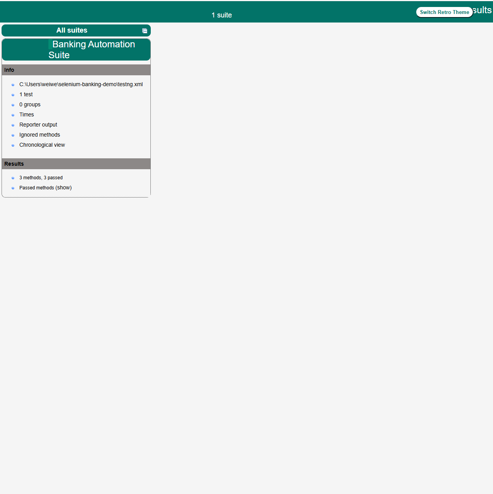

# selenium-banking-demo
Automated testing framework for banking application using Selenium WebDriver, Java, and TestNG
# Banking Application Test Automation Framework

## 📋 Overview
Automated testing framework for banking application demo using Selenium WebDriver, Java, and TestNG. Implements Page Object Model design pattern for maintainable and scalable test automation.

## 🛠️ Tech Stack
- **Language**: Java 11
- **Automation Tool**: Selenium WebDriver 4.15
- **Testing Framework**: TestNG 7.8
- **Build Tool**: Maven
- **Design Pattern**: Page Object Model (POM)
- **Browser**: Chrome (managed by WebDriverManager)

## 📁 Project Structure
```
selenium-banking-demo/
├── src/
│   ├── main/java/
│   │   ├── pages/              # Page Object classes
│   │   │   ├── LoginPage.java
│   │   │   ├── DashboardPage.java
│   │   └── utils/              # Utility classes
│   │       └── DriverManager.java
│   └── test/java/
│       └── tests/              # Test classes
│           ├── BaseTest.java
│           └── LoginTest.java
├── pom.xml                     # Maven dependencies
├── testng.xml                  # TestNG configuration
└── README.md
```

## ✨ Features
- Page Object Model implementation for better code maintainability
- Reusable WebDriver management through DriverManager
- TestNG framework for test execution and reporting
- Automatic browser driver management via WebDriverManager
- Cross-browser testing ready (currently Chrome)
- Organized test structure with BaseTest for common setup/teardown

## 🚀 Getting Started

### Prerequisites
- Java JDK 11 or higher
- Maven 3.6+
- Chrome browser

### Installation
1. Clone the repository:
```bash
git clone https://github.com/yourusername/selenium-banking-demo.git
cd selenium-banking-demo
```

2. Install dependencies:
```bash
mvn clean install
```

### Running Tests
Run all tests:
```bash
mvn test
```

Run specific test suite:
```bash
mvn test -DsuiteXmlFile=testng.xml
```

## 📊 Test Coverage
Current test scenarios:
- ✅ Valid login verification
- ✅ Invalid credentials handling
- ✅ Empty field validation
- ✅ Dashboard elements verification

## 🎯 Future Enhancements
- [ ] Add ExtentReports for detailed HTML reporting
- [ ] Implement data-driven testing with CSV/Excel
- [ ] Add API testing integration
- [ ] Implement parallel execution
- [ ] Add CI/CD integration (Jenkins/GitHub Actions)
- [ ] Cross-browser testing (Firefox, Edge)

## 📝 Notes
- Demo application: https://demo.guru99.com/V4/
- This is a practice project demonstrating automation testing skills
- Test credentials: UserID: `mngr550206` | Password: `YpYredE`

## 👤 Author
Wei Wei (Jodie)
- LinkedIn: [your-linkedin-url]
- Email: jodieweiwei@gmail.com

## 📄 License
This project is for educational and demonstration purposes.

## 📊 Test Results
